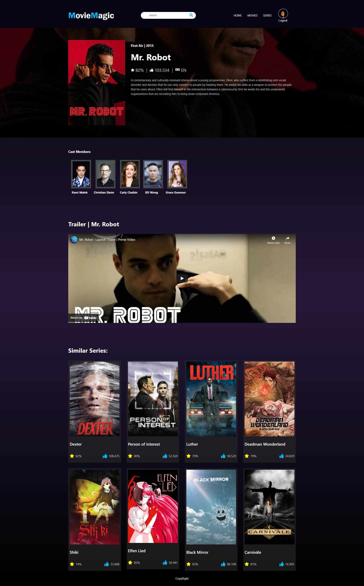

# Movie Magic Application

## App Functionalities

### Overview

- A responsive movie applicaion built with React and The Movie db API. Credits to (Tuat Tran Anh).

#### pages

- landing page: Trending, Movies / Series, Popular,Best rated (with a link to the details page)
- Catalog: Series or Movie overview with a search option.
- Movie / serie detail page, poster, synopsis , Cast members, trailers, related movies or series list.

## Technology, library, framework and other assets used:

- React
- React Router DOM
- SASS
- API: https://www.themoviedb.org/
- Google font: https://fonts.google.com/
- Boxicons: https://boxicons.com/
- Axios
- Swiper
- query-string

## Available Scripts

After cloning and installing dependencies run the following command to start the app:

### `npm start` or `yarn start`

## Deployment GitHub pages

- `yarn add -D gh-pages` or `npm install gh-pages --save-d`
- add to package.json: "homepage": "http://username.github.io/repo",
- "scripts": {
  "predeploy": "npm run build",
  "deploy": "gh-pages -d build"}
- git add . , commit, push.
- Run: `npm run deploy`

## Movie App Preview:

#### Home page:

#### Detail Page:

#### Catalog Page:

